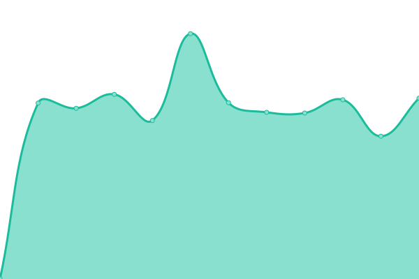
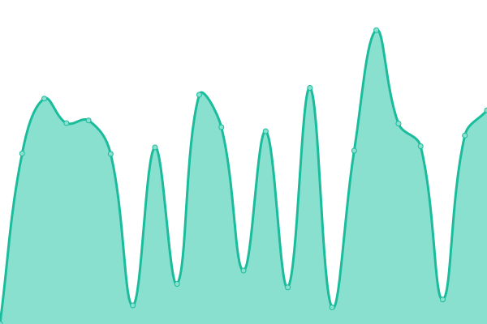

# [📈 Live Status](https://mitrasheamuskhanal.github.io/INS-Tracker): <!--live status--> **🟩 All systems operational**

This repository contains the open-source uptime monitor and status page for [mitrasheamuskhanal](https://mitrasheamuskhanal.github.io/INS-Tracker), powered by [Upptime](https://github.com/upptime/upptime).

With [Upptime](https://upptime.js.org), you can get your own unlimited and free uptime monitor and status page, powered entirely by a GitHub repository. We use [Issues](https://github.com/mitrasheamuskhanal/INS-Tracker/issues) as incident reports, [Actions](https://github.com/mitrasheamuskhanal/INS-Tracker/actions) as uptime monitors, and [Pages](https://mitrasheamuskhanal.github.io/INS-Tracker) for the status page.

<!--start: status pages-->
<!-- This summary is generated by Upptime (https://github.com/upptime/upptime) -->
<!-- Do not edit this manually, your changes will be overwritten -->
<!-- prettier-ignore -->
| URL | Status | History | Response Time | Uptime |
| --- | ------ | ------- | ------------- | ------ |
|  Main-Server | 🟩 Up | [main-server.yml](https://github.com/mitrasheamuskhanal/INS-Tracker/commits/HEAD/history/main-server.yml) | 

 1261ms
     
 | 

<a href="https://mitrasheamuskhanal.github.io/INS-Tracker/history/main-server">98.37%</a>
    

|  Windows-Server | 🟩 Up | [windows-server.yml](https://github.com/mitrasheamuskhanal/INS-Tracker/commits/HEAD/history/windows-server.yml) | 

 963ms
     
 | 

<a href="https://mitrasheamuskhanal.github.io/INS-Tracker/history/windows-server">98.37%</a>
    

|  Storage-Server | 🟩 Up | [storage-server.yml](https://github.com/mitrasheamuskhanal/INS-Tracker/commits/HEAD/history/storage-server.yml) | 

 1222ms
     
 | 

<a href="https://mitrasheamuskhanal.github.io/INS-Tracker/history/storage-server">98.37%</a>
    

|  File-Server | 🟩 Up | [file-server.yml](https://github.com/mitrasheamuskhanal/INS-Tracker/commits/HEAD/history/file-server.yml) | 

 1427ms
     
 | 

<a href="https://mitrasheamuskhanal.github.io/INS-Tracker/history/file-server">98.37%</a>
    

|  Syscserver | 🟩 Up | [syscserver.yml](https://github.com/mitrasheamuskhanal/INS-Tracker/commits/HEAD/history/syscserver.yml) | 

 902ms
     
 | 

<a href="https://mitrasheamuskhanal.github.io/INS-Tracker/history/syscserver">98.37%</a>
    

|  [Vividcraft](https://vividcraft.com.au) | 🟩 Up | [vividcraft.yml](https://github.com/mitrasheamuskhanal/INS-Tracker/commits/HEAD/history/vividcraft.yml) | 

 759ms
     
 | 

<a href="https://mitrasheamuskhanal.github.io/INS-Tracker/history/vividcraft">85.14%</a>
    

<!--end: status pages-->

[**Visit our status website →**](https://mitrasheamuskhanal.github.io/INS-Tracker)

## 📄 License

- Powered by: [Upptime](https://github.com/upptime/upptime)
- Code: [MIT](./LICENSE) © [Anand Chowdhary](https://anandchowdhary.com), supported by [Pabio](https://pabio.com)
- Data in the `./history` directory: [Open Database License](https://opendatacommons.org/licenses/odbl/1-0/)
